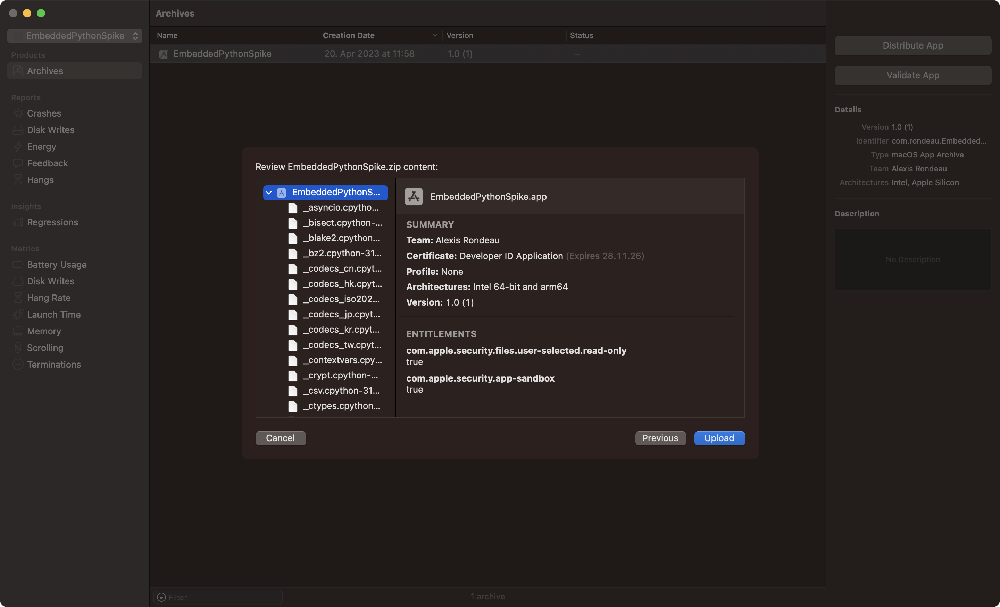
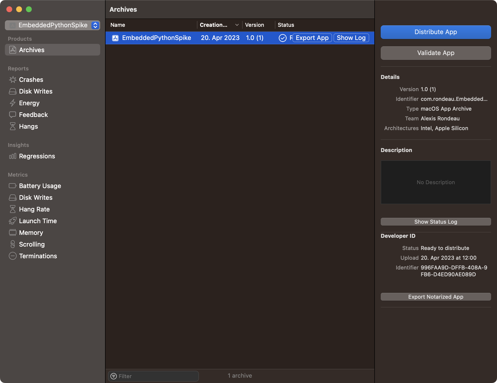

## Template for embedding Python in a signed macOS app
- Started here https://medium.com/swift2go/embedding-python-interpreter-inside-a-macos-app-and-publish-to-app-store-successfully-309be9fb96a5
- Didn't understand the run script part
- Found this comment: https://medium.com/@eddieespinal/great-tutorial-eldar-thank-you-for-sharing-it-a8206d657e3a that recommended this signing code:

```bash
set -e

echo "Signing contents of $CODESIGNING_FOLDER_PATH/Contents/Resources/python-stdlib/lib-dynload as $EXPANDED_CODE_SIGN_IDENTITY_NAME ($EXPANDED_CODE_SIGN_IDENTITY)"

cd "$CODESIGNING_FOLDER_PATH/Contents/Resources/python-stdlib/lib-dynload"

/usr/bin/codesign --force --sign "$EXPANDED_CODE_SIGN_IDENTITY" --options runtime --timestamp=none --preserve-metadata=identifier,entitlements,flags --generate-entitlement-der *.so
```

- Then found this post https://butternut-ray-869.notion.site/Embedding-Python-in-a-Swift-App-Using-Xcode-Apple-Silicon-and-Intel-59f5a3c832914a96990dfcc0e610c720 which ultimately (except the signing script part) worked 

## Successful Test Output
```log
Python Version: 3.11
Python Encoding: UTF-8
Python Path: ['/Users/$HOME/Library/Developer/Xcode/DerivedData/EmbeddedPythonSpike-ehqmlmwnoppyokdrvctjjjowcsrq/Build/Products/Debug/EmbeddedPythonSpike.app/Contents/Resources/python-stdlib', '/Users/$HOME/Library/Developer/Xcode/DerivedData/EmbeddedPythonSpike-ehqmlmwnoppyokdrvctjjjowcsrq/Build/Products/Debug/EmbeddedPythonSpike.app/Contents/Resources/python-stdlib/lib-dynload', '/Users/$HOME/Library/Developer/Xcode/DerivedData/EmbeddedPythonSpike-ehqmlmwnoppyokdrvctjjjowcsrq/Build/Products/Debug/EmbeddedPythonSpike.app/Contents/Resources/python-stdlib/lib/python311.zip', '/Users/$HOME/Library/Developer/Xcode/DerivedData/EmbeddedPythonSpike-ehqmlmwnoppyokdrvctjjjowcsrq/Build/Products/Debug/EmbeddedPythonSpike.app/Contents/Resources/python-stdlib/lib/python3.11', '/Users/$HOME/Library/Developer/Xcode/DerivedData/EmbeddedPythonSpike-ehqmlmwnoppyokdrvctjjjowcsrq/Build/Products/Debug/EmbeddedPythonSpike.app/Contents/Resources/python-stdlib/lib/python3.11/lib-dynload']
```

## Archiving and Notarization

- Product > Archive > Distribute App > 'Distribute as developer'
- Signing files (takes about a minute)
- Upload to Apple
- Waiting...
- Ready to distribute!




