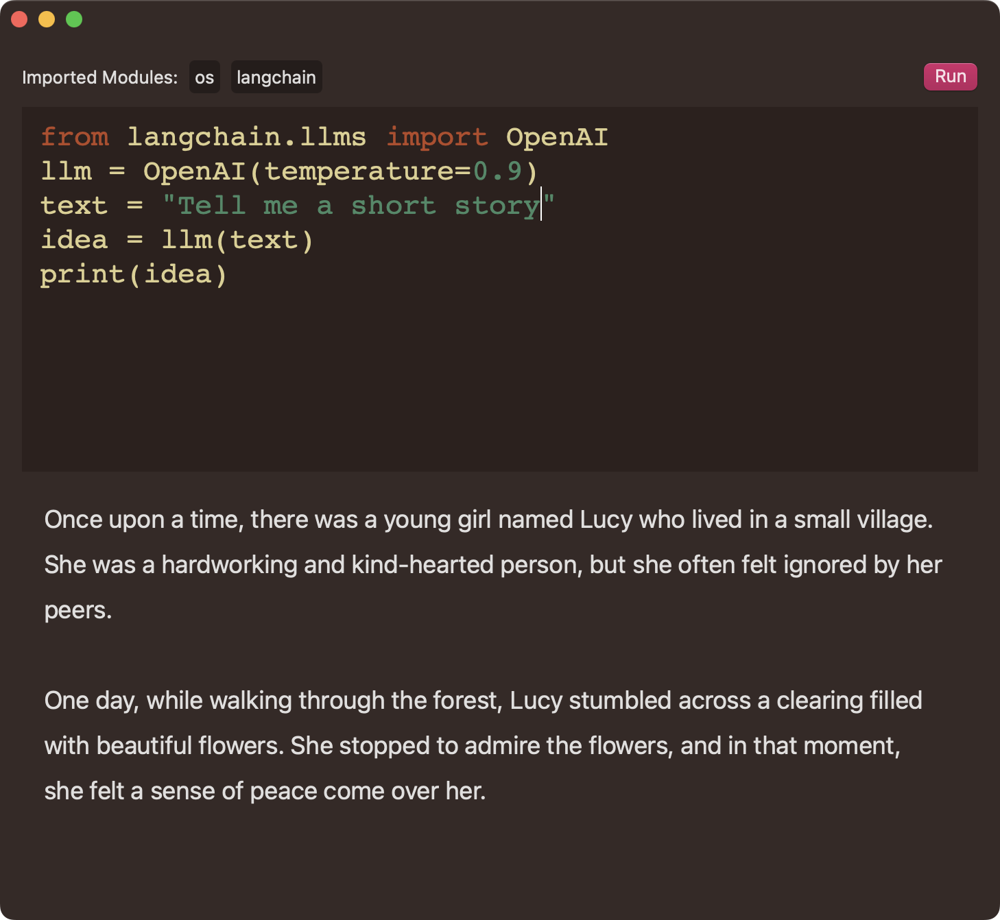

## Development
- Copy APIConfig.xcconfig with OpenAI API Key to $ROOT/src/Backend

### LangChain Updates
- 

## Evolution

- Based on [my template for embedding Python in a signed macOS app](https://github.com/akaalias/EmbeddedPythonAppTemplate)
