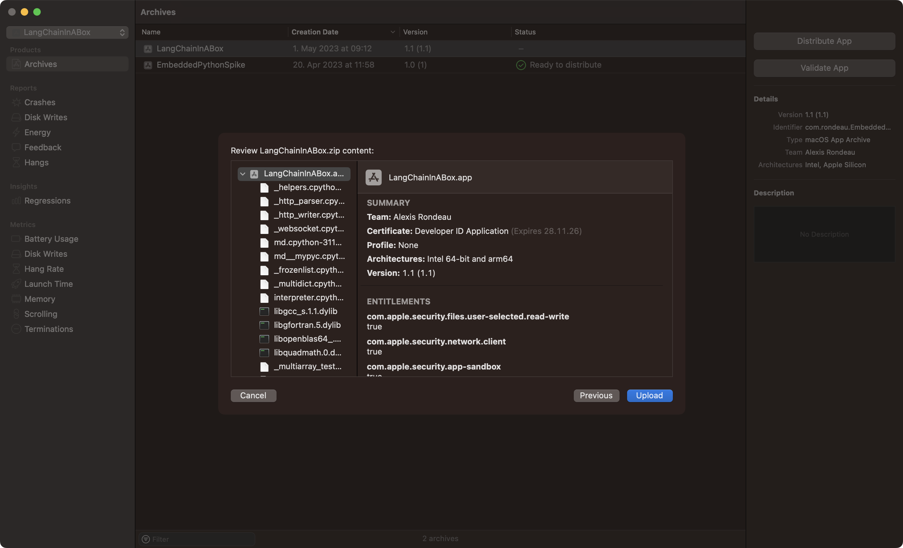

# LangChain in a Box
Hi there, [Alexis](https://alexisrondeau.me) here! 

I [make](https://jamgpt.app) 👏🏻 [things](https://unblah.me/) 👏🏻 [that](https://getpudding.app/) 👏🏻 [do](https://getstreamline.app/) 👏🏻 [things](https://alexisrondeau.me/algorand-ballet/). 

This project is a 'batteries-included' macOS UI for LangChain. It ships with a self-contained, embedded, Apple-notarisable Python 3.11 and LangChain libraries. It also includes documentation on how to update langchain dependencies over time.

Why? Access to LangChain should be easy for those who want to change the world.

I saw my girlfriend fully embrace GPT-4 via [an app](https://jamgpt.app) I built for her. Even though it's "just a UI to GPT-4", it comes batteries-included. This allowed her to fully focus only on her projects and not the technology.

The hard, and tedious, part - like installing brew, getting the right Python version, creating the right venv, updating langchain, choosing and learning an IDE - should not a barrier to entry for her. 


## Development Notes
To build with XCode, please create APIConfig.xcconfig under $ROOT/EmbeddedPythonSpike/Backend with this content

```bash
$ cd $PROJECT_ROOT
$ touch ./EmbeddedPythonSpike/Backend/APIConfig.xcconfig
$ echo "OPENAI_API_KEY = your-api-key" > ./EmbeddedPythonSpike/Backend/APIConfig.xcconfig
```

### How to update LangChain and its dependencies

See [the documentation](./python-langchain/README.md) for details (Not shown in XCode, use Terminal)

## UI Evolution


## Distributing the App 
This project is based on [my template for embedding Python in a signed macOS app](https://github.com/akaalias/EmbeddedPythonAppTemplate), which itself stands on the shoulders of these giants: [Eldar Eliav](https://medium.com/swift2go/embedding-python-interpreter-inside-a-macos-app-and-publish-to-app-store-successfully-309be9fb96a5), [Eddie Espinal](https://medium.com/@eddieespinal), and [this person](https://butternut-ray-869.notion.site/Embedding-Python-in-a-Swift-App-Using-Xcode-Apple-Silicon-and-Intel-59f5a3c832914a96990dfcc0e610c720)

So far, I've tested 



